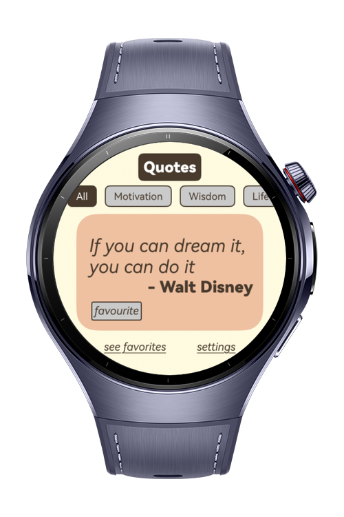
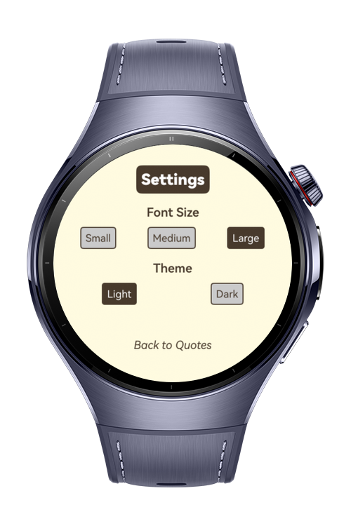
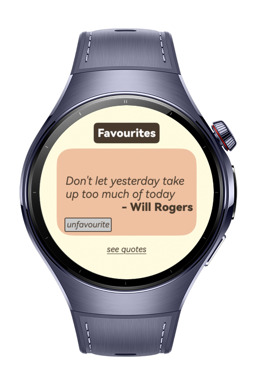

> **Note:** To access all shared projects, get information about environment setup, and view other guides, please visit [Explore-In-HMOS-Wearable Index](https://github.com/Explore-In-HMOS-Wearable/hmos-index).

# Daily Quotes

Daily Quotes is a wearable watch application that displays random inspirational quotes built for
**HarmonyOS NEXT wearable devices**, developed using **ArkTS**. It demonstrates ArkUI design and Local Preferences with
favorite/unfavorite features.

# Preview

<div>
  
  
  
  
</div>

# Use Cases

Daily Quotes Watch App is designed to provide quick inspiration and motivation through random quotes, right from your
wrist. The following are the application's featured use cases:

1. Daily Random Inspiration: Users receive randomly selected motivational or thoughtful quotes to brighten their day.
2. Favourites Management: With a simple tap, users can mark quotes as favorite or unfavorite, building their own
   personal collection.
3. Instant Access via Watch Interface: Quotes are displayed directly on the smartwatch with a clean, minimal ArkUI
   design for quick readability.
4. Local Preferences Support: Favorites and user selections are stored locally using Local Preferences for a
   personalized experience.
5. Lightweight and Battery-Friendly: Optimized for wearable devices, the app delivers smooth performance with minimal
   battery usage.

# Tech Stack

- **Languages**: ArkTS
- **Frameworks**: HarmonyOS SDK 5.1.0(18)
- **Tools**: DevEco Studio Version 5.1.0.849
- **Libraries**:
    - `@kit.AbilityKit`
    - `@kit.ArkUI`
    - `@kit.PerformanceAnalysisKit`

# Directory Structure

  ```
entry/src/main/ets/
│
├── common/                           # Common/shared utilities across the app
│   └── utils/                        # Helper classes and utility functions
│       └── Preferences               # Local Preferences handling (save/load favourites, settings)
│
├── pages/                            # UI pages (screens) for the watch app
│   ├── SplashPage                    # Initial splash screen shown at startup
│   ├── FavouriteQuotesPage           # Page to view and manage favourite quotes
│   └── SettingsPage                  # Page to change font size and theme
│
├── viewmodels/                       # State management layer (MVVM pattern)
│   └── DailyQuoteViewModel           # Handles logic for fetching quotes, favourite/unfavourite actions
│
├── model/                            # Data models for the app
│   └── DailyQuoteModel               # Represents a Quote (fields like text, author, isFavourite)
│
├── entryability/                     # Main application entry point
│   └── EntryAbility                  # Ability class that starts the app and manages navigation
│
└── entrybackupability/               # Backup entry (for background or recovery purposes)
    └── EntryBackupAbility              # Handles backup/restore scenarios (if needed)
  ```

# Constraints and Restrictions

## Suported Devices

- Huawei Watch 5

# License

**DailyQuotesApp** is distributed under the terms of the MIT License
See the [LICENSE](./LICENSE) for more information.
